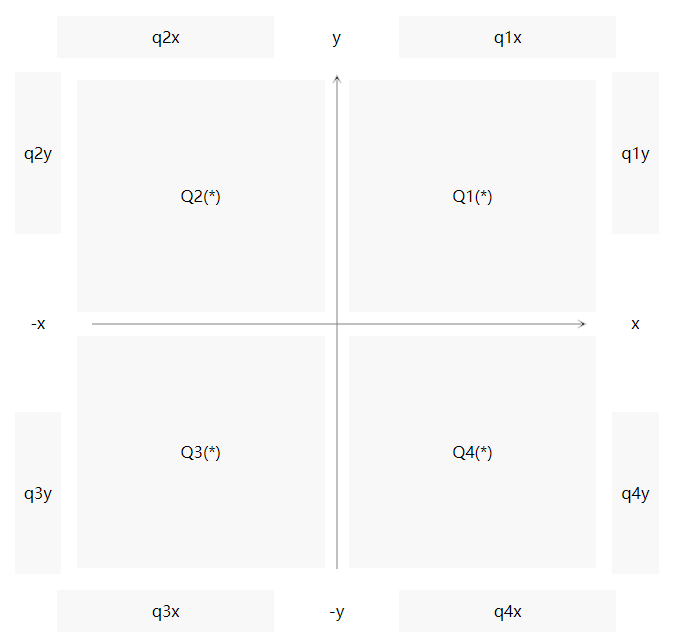

# XY | Quadrant Analysis | 四象限分析


## Context
```json
{
    "context": {
        "title": "{title}",
        "uri": "{uri}",
        "description": "{markdown}"
    }
}
```

## Diagram & Data


```json
{
    "q1": {
        "title": "Q1(*)",
        "titleColor": "black",
        "backgroundColor": "#f8f8f8",
        "description": "",
        "descriptionType": "markdown",
        "semantics": []
    },
    "q2": {},
    "q3": {},
    "q4": {},

    "q1x": {},
    "q1y": {},
    "q2x": {},
    "q2y": {},
    "q3x": {},
    "q3y": {},
    "q4x": {},
    "q4y": {},

    "xPlusInfinity": {}, // x
    "xMinusInfinity": {}, // -x
    "yPlusInfinity": {}, // y
    "yMinusInfinity": {} // -y
}
```
